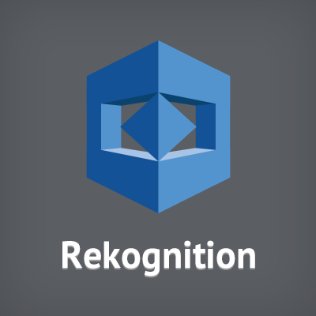

<!--
title: 'Analyzing image with AWS Rekognition'
description: 'In this example, we are going to extract data from a document or identify an object.'
layout: Doc
framework: v3
platform: AWS
language: nodejs14
priority: 1
authorLink: 'https://github.com/pbitalo/analyzing-image-with-rekognition'
authorName: 'Ítalo Pereira de Brito'
-->

# Title

Analyzing image with AWS Rekognition

## Description

In this example, we are going to extract data from a document or identify an object.

## Requirements

- [AWS CLI](https://aws.amazon.com/cli/)
- [Node.js 14](https://nodejs.org/)
- [Serverless Framework’s](https://www.serverless.com/framework/docs/getting-started)

## Icon

<p align="center">
  
</p>

### Invocation

After successful clone project, you run:

```bash
npm i
sls invoke local -f img-analysis or npm run invoke-local
```

Which should result in response similar to the following:

```json
{
  "statusCode": 200,
  "body": {
    "labels": [],
    "extractText": ""
  }
}
```

## Prediction Result

<p align="center">
  
</p>
